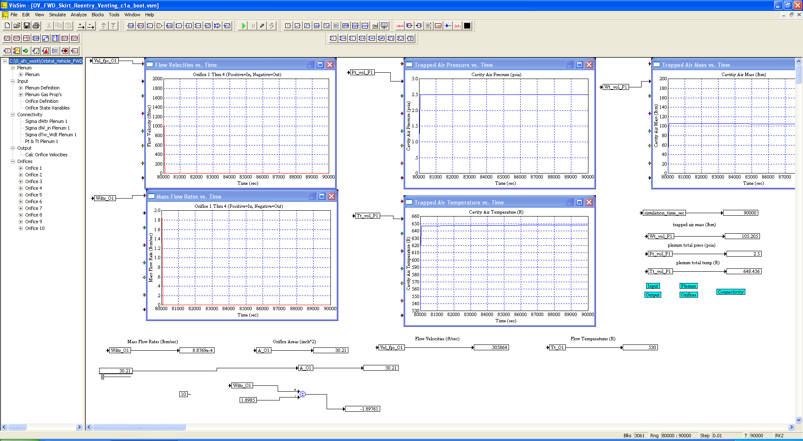
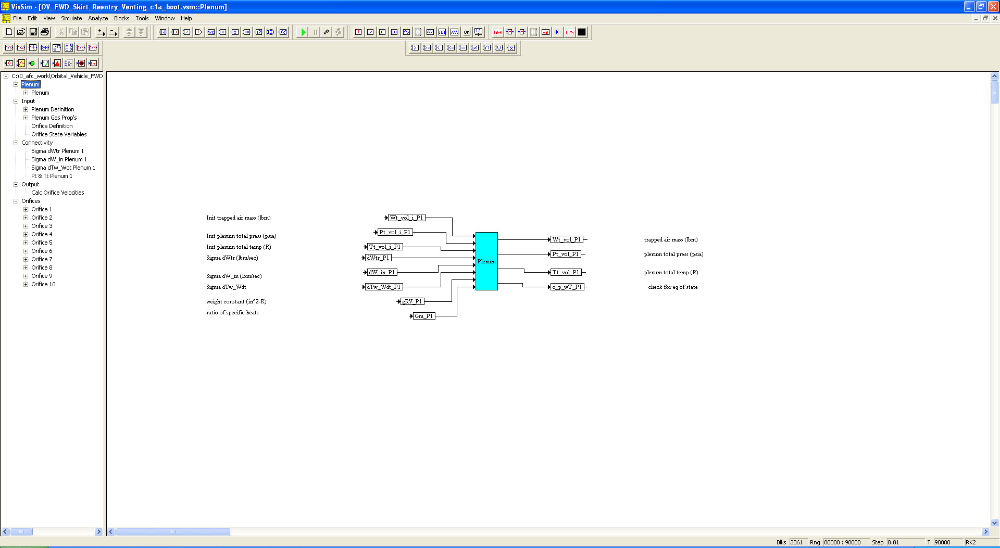
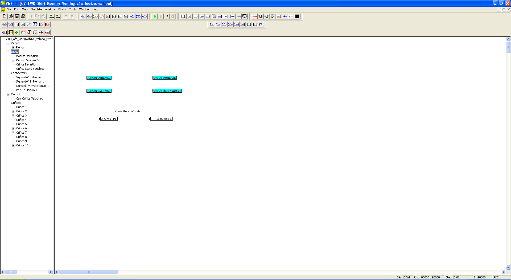
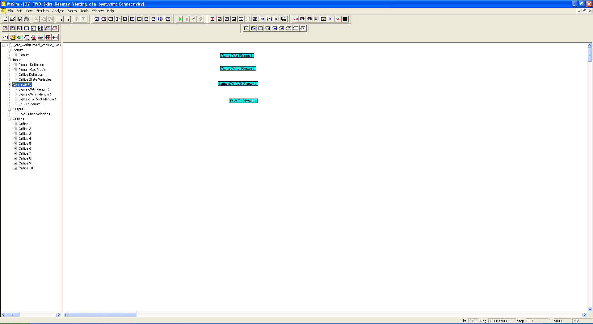
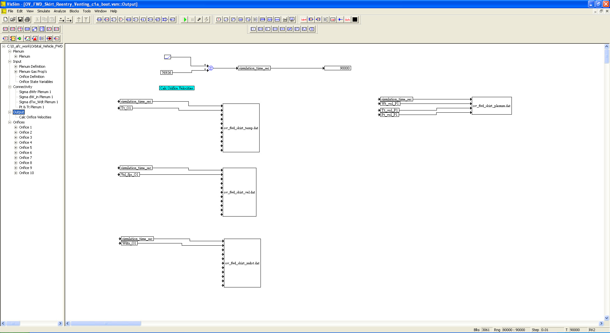
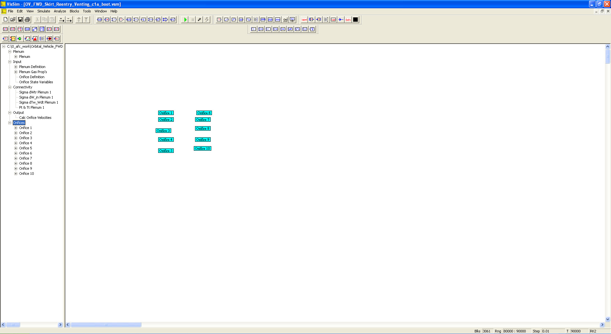

# ========================================
# Orbital Vehicle FWD Skirt Reentry Venting Thermal Analysis using VISSIM:
# ========================================

## Orbital Vehicle FWD Skirt Reentry Venting Thermal Analysis using VISSIM.

##
## I. Operation: "./VISSIM/OV_FWD_Skirt_Reentry_Venting_c1a_boot.vsm"

##
## II. OV FWD Skirt Reentry Venting Top Level Diagram:

##
## III. Plenum Sub-System Level Diagram:

##
## IV. Input Sub-System Level Diagram:

##
## V. Connectivity Sub-System Level Diagram:

##
## VI.  Output Sub-System Level Diagram:

##
## VII. Orifices Sub-System Level Diagram:

##
## VIIIa. Results: "./VISSIM/ov_fwd_skirt_mdot.dat"
## VIIIb. Results: "./VISSIM/ov_fwd_skirt_plenum.dat"
## VIIIc. Results: "./VISSIM/ov_fwd_skirt_temp.dat"
## VIIId. Results: "./VISSIM/ov_fwd_skirt_vel.dat"

## 
## *Note: 
## 1. Performance Data and Analysis performed using VISSIM, ( https://web.solidthinking.com/vissim-is-now-solidthinking-embed )

